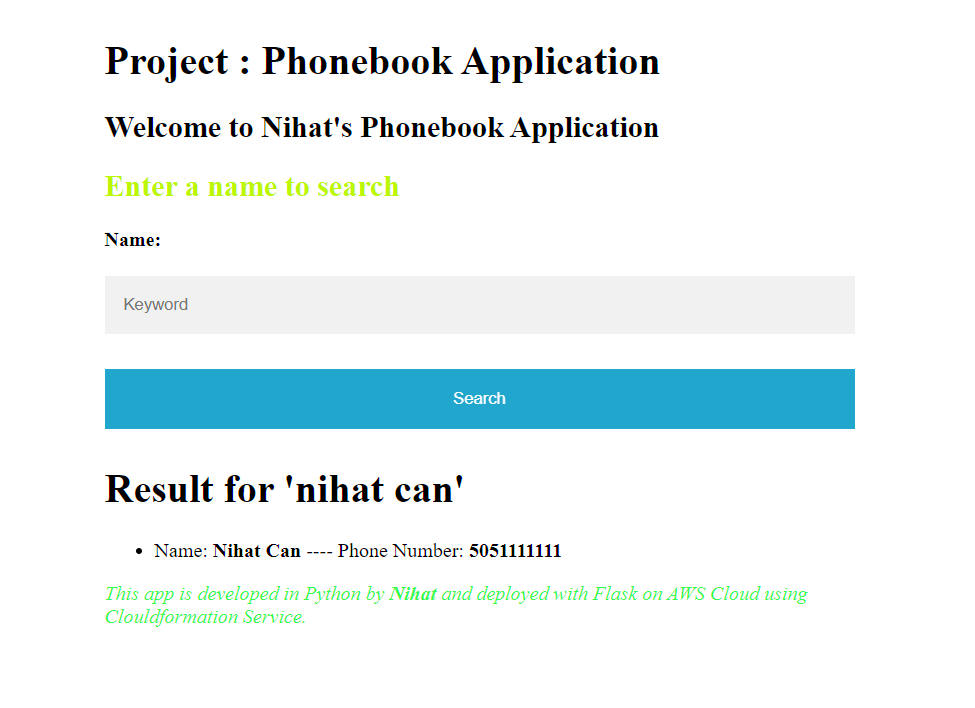
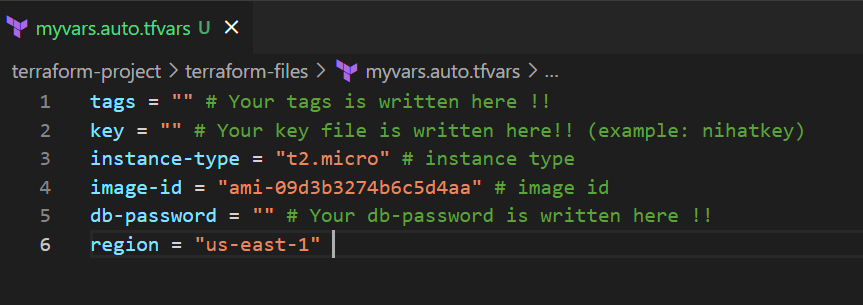

 PHONEBOOK-PROJECT
 
 Descripton: Phonebook Application, I aimed to build a phonebook application in Python and deploy it as a web application using Terraform with Flask on an AWS Application Load Balancer with Auto-Scaling Group of Elastic Compute Cloud (EC2) Instances and Relational Database Service (RDS).

 Road Map:

 

 Security Groups:

 

Outcome:

Search page

Add page 

Delete page

Update page

NOTE: You must customize your variable in terraform-files/myvars.auto.tfvars file.

